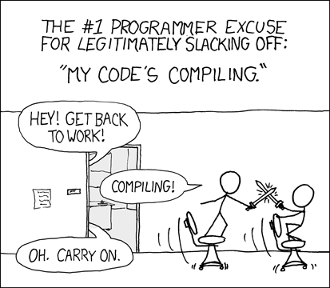

---
# You can also start simply with 'default'
theme: default
# Force dark mode only
colorSchema: dark
# some information about your slides (markdown enabled)
title: An Introduction to Go
info: |
  ## An Introduction to Go
  A quick run through of the what, the why, and the how of Go
# https://sli.dev/features/drawing
drawings:
  persist: false
# slide transition: https://sli.dev/guide/animations.html#slide-transitions
transition: view-transition
# enable MDC Syntax: https://sli.dev/features/mdc
mdc: true
# Layout for the slide
layout: cover
---


# An Introduction to Go

A quick run through of the what, the why, and the how of Go

<div class="absolute bottom-10 opacity-66">
  <small>Elliot Wright // <CurrentYear /></small>
</div>

<!--
The last comment block of each slide will be treated as slide notes. It will be visible and editable in Presenter Mode along with the slide. [Read more in the docs](https://sli.dev/guide/syntax.html#notes)
-->

---
layout: center
---

# What we're about to cover

<div class="max-w-[600px]">

* What is Go?
* Why use Go?
* How to Go
* Where to Go

These slides are also [available online](https://pres-go-intro.pages.dev) for you to view later, if
you want!

</div>

---
layout: section
---

# What is Go?

---
layout: center
---

# What is Go?

<div class="max-w-[600px]">

Go is a programming language designed at, and supported by Google, that aims to make it easy to 
build simple, reliable, and efficient software.

<div class="flex gap-8">

<div>

It is:

* High-level & garbage collected
* C-like in syntax
* Statically, and structurally typed
* Compiled
* Efficient and performant
* Easy to learn, read, and write

</div>

<div class="grow flex items-center">
<div class="grow">

```go {*}{lines:true}
package main

import "fmt"

func main() {
	fmt.Println("Hello, World!")
}
```

</div>
</div>

</div>

</div>

<!--
Structural typing is a class of type system where type compatibility and equivalence are determined
by the type's actual structure or definition and not by other characteristics such as the name given
to the type.
-->

---
layout: center
---

# Why was it created?

<div class="max-w-[600px]">

The team behind Go saw problems with how software was being developed at Google, and designed the 
language to address issues faced "today".

<div class="flex gap-8">

<div class="basis-3/5">

* Missing or poor concurrency support
* Complexity (of the language, tooling, and ecosystem)
* Lack of scalability
* "Insane" build times

</div>

<div class="basis-2/5">



</div>

</div>

</div>

<!--
Lack of scalability here refers to the ability to write and maintain large codebases, scaling up to
large teams, and large systems.

The story goes that Go was designed while waiting for other programs to compile.

Go is designed to be a clean, small, compiled language with modern features, aiming to tackle
improving productivity in an era of multicore processors, networked systems, and large codebases.

Go was initially built in 2007 and subsequently released to the public in 2009.

Some of this is taken from a presentation that one of the creators of Go gave.
https://go.dev/talks/2015/gophercon-goevolution.slide#5

More background:
https://go.dev/talks/2012/splash.article#TOC_3.
-->

---
layout: quote
---

# It's about **expressing algorithms**, not the type system.

\- Robert Griesemer, Go co-creator

---
layout: section
---

# Why use Go?

(Or, why I like Go)

---
layout: two-cols
class: p-4
---

<div class="flex h-full items-center justify-center">

# It's simple and gets out of the way

</div>

::right::

<div class="flex h-full items-center justify-center">
  
</div>

---
layout: two-cols
class: p-4
---

<div class="flex h-full items-center justify-center">
  
</div>

::right::

<div class="flex h-full items-center justify-center">

# It's fast, efficient, and compiles to a native binary with no runtime dependencies

</div>

---
layout: two-cols
class: p-4
---

<div class="flex h-full items-center justify-center">

# It has tools built-in to format, lint, test, build, and profile your code, and handle dependency management

</div>

::right::

<div class="flex h-full items-center justify-center">
  
</div>

---
layout: two-cols
class: p-4
---

<div class="flex h-full items-center justify-center">
  
</div>

::right::

<div class="flex h-full items-center justify-center">

# It has a great standard library, and a community that rallies around it

</div>

---
layout: two-cols
---

<div class="flex h-full items-center justify-center">

# It has sane concurrency primitives promoting safe and efficient concurrent programming

</div>

::right::

<div class="flex h-full items-center justify-center">
  
</div>

<!--
Do not communicate by sharing memory; instead, share memory by communicating.

https://go.dev/blog/codelab-share
-->

---
layout: two-cols
class: p-4
---

<div class="flex h-full items-center justify-center">
  
</div>

::right::

<div class="flex h-full items-center justify-center">

# It strikes a good balance between verbosity, safety, and control

</div>

---
layout: center
---

# You'd be in good company
Go is arguably the language of the Cloud.

<div class="max-w-[600px]">

* Docker / Containerd
* Google: DL, GCP, Kubernetes, Search Indexing, YouTube, more
* Hashicorp: Consul, Nomad, Packer, Terraform, Vault
* Prometheus / Grafana
* Out of 31 [graduated CNCF projects](https://contribute.cncf.io/contributors/#graduated-projects), 23 are written in Go
* Cloudflare, Dropbox, Heroku, Meta, Microsoft, Monzo, Netflix, PayPal, Salesforce, Shopify, SoundCloud, Trivago, Twitch.tv, Uber, [many more...](https://go.dev/solutions/case-studies)
* Ice Travel Group 😁

</div>

---
layout: section
---

# How to Go

---
layout: center
---

# Basic Go Syntax

<<< @/snippets/overview/main.go {*|1|3-6|8-11|13|14-19|21-28}{lines:true,maxHeight:'353px'}

---
layout: center
---

# Structs and Interfaces

<<< @/snippets/interfaces/main.go {*|8-10|12-18|20-22|24-30|12-18}{lines:true,maxHeight:'353px'}

<!--
No need to preemptively create interfaces.
Define interfaces where a type would be used, not where the type is defined.

No classes. No inheritance (composition). No explicit implementing interfaces.
-->

---
layout: center
---

# Error Handling & Multiple Return Values

<<< @/snippets/errors/main.go {*|8-11|14|14-29|23|26|28|32|33-43|31-46}{lines:true,maxHeight:'353px'}

<!--
Sentinel errors, or errors that are defined as constants

No exceptions. No throwing / catching.
-->

---
layout: center
---

# Concurrency & Goroutines

<<< @/snippets/concurrency/main1.go {*}{lines:true,maxHeight:'353px'}

---
layout: center
---

# Concurrency & Goroutines

<<< @/snippets/concurrency/main2.go {*}{lines:true,maxHeight:'353px'}

<!--
Don't communicate by sharing memory, share memory by communicating
-->

---
layout: center
---

# Concurrency & Goroutines

<<< @/snippets/concurrency/main3.go {*|7-16|18-24|27-29|31-37|39-41}{lines:true,maxHeight:'353px'}

<!--
https://go.dev/blog/pipelines
-->

---
layout: section
---

# Where to Go

(Next)

---
layout: center
---

# Learning Resources

* A Tour of Go: https://go.dev/tour/welcome/1
* Go by Example: https://gobyexample.com/
* CodeReviewComments: https://go.dev/wiki/CodeReviewComments
* Effective Go: https://go.dev/doc/effective_go
* Documentation: https://go.dev/doc/
* Other learning resources: https://go.dev/learn/

Give it a Go! (😩)

---
layout: center
---

# Thank you!

<div class="text-center">

Any questions?

</div>
